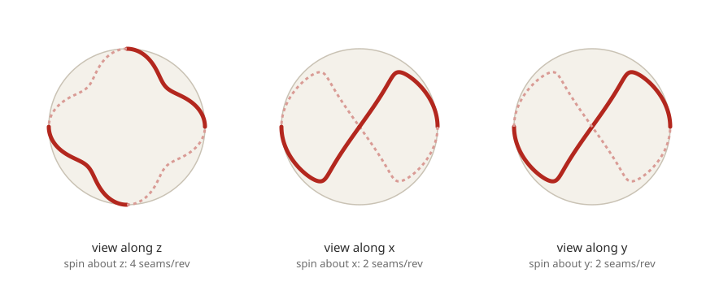

# 変化球軌道シミュレーション 設計書

**プロジェクト名:** breaking-ball-lbm
**版:** v0.3（検証ケース確定：WBC2023決勝 大谷翔平対トラウト最終球）
**作成日:** 2026-09-15

---

## 0. 本ドキュメントの位置づけ

本書は、格子ボルツマン法 (Lattice Boltzmann Method, LBM) による3次元非定常乱流シミュレーションを用いて、投球（特に変化球）の空気力学的挙動と軌道を再現する解析コードの**理論的背景**と**ソフトウェア設計**をまとめたものである。実装（Julia + CUDA.jl）に着手する前段階の設計合意を目的とする。

> **v0.2での確定事項（v0.1からの変更点）**
> - 検討したいピッチ条件は少数（数条件程度）であるため、軌道再現の忠実度を優先し、**密結合方式（層1/層2に分けたテーブル補間方式ではなく、CFDと運動方程式を毎ステップ結合する方式）**を既定方針とする（§4.4を全面改訂）。
> - 開発言語は **Julia**（CUDA.jl によるGPUカーネル実装）とする（§6, §7を全面改訂）。
> - 実行環境は**単一のコンシューマGPU（NVIDIA GeForce RTX 3060 Ti, VRAM 8GB）＋ CPU: Intel Core i5-13400K ＋ メモリ32GB**を前提とする。マルチGPU/マルチノードは将来拡張として設計のみ残す（§6.3）。
> - 縫い目形状は、公式球そのもののオープンなSTL/CADデータは確認できなかったため、CFD文献で広く使われている簡略形状（二重らせん状の縫い目軌跡＋凸断面）を実測寸法に基づいて再現するパラメトリックモデルを採用する（§4.1）。

### 0.1 目的（ゴール）

- 回転する野球ボール（縫い目付き球体）まわりの3次元非定常乱流場をLBMで解く。
- 抗力・揚力（マグヌス力）・非マグヌス力（縫い目由来の横力）を物理的に導出し、投球軌道を再現する。
- 球速・回転数・回転軸・縫い目に対する回転軸の向き（4シーム/2シーム相当）・大気条件（気温・気圧・湿度・風）をパラメータとして、**数条件の変化球ケース**を比較できる。
- 単一のコンシューマGPU上で、現実的な時間（1条件あたり数時間〜1日程度を目標）で計算を終える。

### 0.2 スコープ外（v1では扱わない）

- 空力弾性（ボールの変形）は扱わない（剛体球として扱う）。
- バットとの衝突・打球シミュレーションは対象外（投球フェーズのみ）。
- ナックルボールの縫い目方向の時々刻々の乱雑な変化は将来拡張とし、初版では固定軸回転（スピン一定）を基本ケースとする。
- 多数条件（数十〜数百）のパラメトリックスタディ・係数データベース化は行わない（§4.4の「将来拡張」参照。少数条件を高忠実度で解くことが今回のゴール）。

---

## 1. 物理理論（空気力学）

### 1.1 野球ボールの基本諸元

| 項目 | 値 |
|---|---|
| 直径 | 約 0.0746〜0.0749 m（公式規定：円周 9.00–9.25 in ⇒ 直径 約72.9–74.9 mm。設計上は中央値 0.0748 m をデフォルトとしパラメータ化） |
| 質量 | 約 0.142〜0.149 kg（既定 0.145 kg） |
| 縫い目 | **1本の連続した二重縫い目（108 double stitches）**が球面を二重らせん状に一周する構造（後述、2シーム/4シームは別々の縫い目形状ではなく、この1本の縫い目に対する回転軸の向きの違いを指す）。縫い目の凸高さは実測で平均約 **0.79 mm（0.031 in、直径比 D/92 程度）**と報告されている。 |
| 代表投球速度 | 20〜45 m/s（アマチュア〜プロの速球〜変化球） |
| 代表回転数 | 1500〜3500 rpm（変化球・スピン系速球では2000rpm超も） |

**訂正・明確化（v0.1からの修正）：** v0.1では「2シーム／4シームなど縫い目パターン」を幾何形状のバリエーションであるかのように記載していたが、正しくは野球ボールの縫い目は幾何学的に1種類（108個の二重縫い目からなる単一の連続曲線）であり、投げ方（グリップ）によって**この固定された縫い目パターンに対する回転軸の向き・位相が変わる**ことで、1回転あたり気流を「乱す」縫い目の本数が実効的に4本相当・2本相当に見える、という違いである。したがってジオメトリとしては縫い目曲線を1つだけ実装し、設定パラメータとしては「回転軸の向き（チルト角・ヨー角）」と「縫い目パターンに対する初期位相角」を持たせる設計とする（§4.1, §7.2）。

### 1.2 支配的な無次元パラメータ

- **レイノルズ数** \(Re = \dfrac{U D}{\nu}\)
  代表条件（\(U=40\ \text{m/s}\)、\(D=0.0748\ \text{m}\)、\(\nu_{air}\approx1.5\times10^{-5}\ \text{m}^2/\text{s}\)）で \(Re \approx 2.0\times10^{5}\)。文献値でも投球速度域は \(Re \approx 1.1\text{–}2.4\times10^{5}\) と報告されている（Nathan, *AJP* 2008; Kensrud thesis）。この \(Re\) は「臨界レイノルズ数（drag crisis）」が生じる遷移域に重なるため、境界層の層流→乱流遷移の位置・様相が抗力に敏感に効く。
- **スピンパラメータ（無次元回転数）** \(S = \dfrac{\omega r}{U}\)（\(\omega\)：角速度、\(r\)：半径）
  実投球では \(S \approx 0.09\text{–}0.6\) 程度。
- **マッハ数** \(Ma = U/c\) は 0.15 以下で圧縮性の影響は小さいが、LBMは元来弱圧縮性モデルであるため後述のとおり格子単位設計で音速との比を制御する必要がある。

### 1.3 抗力（Drag）とドラッグクライシス

滑らかな球では、境界層が層流のまま剥離する亜臨界域で \(C_D\approx0.5\) 程度と大きいが、\(Re\) が臨界値を超えると境界層が乱流遷移して剥離点が後方に移動し、\(C_D\) が急減する（**drag crisis**）。

野球ボールは縫い目が人工的な乱流トリップ（turbulence trip）として働くため、滑らかな球のような急峻なドラッグクライシスは示さず、**縫い目の向きに依存してなだらかかつ非対称に \(C_D\) が変化する**ことが実験的に確認されている（Kensrud thesis; *A study of baseball and softball aerodynamics*）。したがって本シミュレーションでは、単なる滑面球ではなく**縫い目形状を含めた表面ジオメトリで直接、境界層遷移・剥離を解像／モデル化する**方針をとる。

### 1.4 揚力（マグヌス効果）と非マグヌス力

回転する球のまわりでは、回転方向側の境界層が加速され剥離が遅れ、反対側では剥離が早まることで循環（循環流れ）が生じ、進行方向に垂直な力（マグヌス力）が発生する：

\[
F_L = \tfrac{1}{2}\rho U^2 A\, C_L(S,\,Re,\,\text{seam orientation})
\]

実験的には、\(S<0.4\) 程度の範囲で \(C_L \approx S\)（傾き1の線形関係）が良い近似となる（Nathan 2008; Lyu, *The dependence of baseball lift and drag on spin*）が、この関係は**滑面球の理想解に対する近似**であり、実際の野球ボールでは縫い目の向きによって主流に対して非対称な圧力分布が生じ、マグヌス面（回転軸に直交する平面）から外れた方向の力＝**非マグヌス力（横力）**が発生することが知られている。これがスライダーやジャイロボールで「理論値どおりに曲がらない」現象の主要因である。

**設計上の要件:** 本コードは、単純化されたマグヌス力の解析式ではなく、**縫い目形状を含む球体表面を境界条件として直接解像**し、\(C_D\)・\(C_L\)・非マグヌス方向の力係数を全て流体場から直接算出できるようにする。これにより回転軸の向き（バックスピン/トップスピン/サイドスピン/ジャイロ回転の合成比率）や縫い目に対する位相といった変化球の分類をパラメータとして比較可能にする。

### 1.5 運動方程式（軌道側）

質量中心の並進運動：

\[
m\frac{d\vec{V}}{dt} = \vec{F}_{drag} + \vec{F}_{Magnus} + \vec{F}_{side} + m\vec{g}
\]

回転運動（角速度減衰、スピン軸のジャイロ効果を含む一般形）：

\[
I\frac{d\vec{\omega}}{dt} = \vec{T}_{aero}
\]

投球中の回転数減衰は数%程度と小さいが、パラメータとしてトルクを流体場から評価できる設計とする（詳細は §4.3）。本設計（密結合方式）では、この運動方程式は**係数テーブルではなくCFDから毎ステップ得る瞬時の力・トルクを直接使って積分**する（§4.4）。

---

## 2. 格子ボルツマン法（LBM）理論

### 2.1 ボルツマン方程式とBGK近似

分子速度分布関数 \(f(\vec{x},\vec{\xi},t)\) に対するボルツマン輸送方程式を、単一緩和時間（BGK）近似で離散化する：

\[
f_i(\vec{x}+\vec{e}_i\Delta t,\ t+\Delta t) - f_i(\vec{x},t) = -\frac{1}{\tau}\left[f_i(\vec{x},t) - f_i^{eq}(\vec{x},t)\right]
\]

- \(f_i\)：離散速度方向 \(i\) の分布関数
- \(\vec{e}_i\)：格子速度ベクトル
- \(\tau\)：無次元緩和時間。動粘性係数と \(\nu = c_s^2(\tau-\tfrac12)\Delta t\) の関係を持つ（\(c_s=1/\sqrt3\) は格子音速）。
- \(f_i^{eq}\)：局所平衡分布（Maxwell-Boltzmann分布の低マッハ数展開）

Chapman-Enskog展開により、上式はマクロスケールで圧縮性の弱いNavier-Stokes方程式に収束することが示される。すなわちLBMは「NS方程式を離散化する」のではなく、**より基礎的な運動論レベルの方程式からNS方程式を導出する**アプローチであり、局所演算のみで構成されるため並列化・GPU実装に極めて適している。

### 2.2 離散速度セット

| モデル | 用途 |
|---|---|
| D3Q19 | 標準的な3次元計算。メモリ効率と精度のバランスが良く、デバッグ・低Re検証に用いる（実装済み）。 |
| D3Q27 | 本番計算（縫い目球・乱流）の既定モデル（実装済み）。中心モーメント衝突演算子は D3Q27 を必須とする：\(\Sigma w c_x^2c_y^2c_z^2\) がD3Q19では0、D3Q27では \(c_s^6\) となり、3方向すべてに分解できるのはD3Q27のみであるため。 |

本プロジェクトの対象 \(Re\sim2\times10^5\) は乱流域であり数値安定性が課題となるため、**本番計算はD3Q27＋Cumulant系衝突演算子**を推奨構成とし、D3Q19+BGKは検証・軽量計算用の代替構成として残す。単一GPU（8GB VRAM）という制約下では、D3Q27はD3Q19よりメモリ使用量が増える点にも留意し、解像度とのトレードオフを§6.5で具体的に検討する。

### 2.3 衝突演算子（安定性のための拡張）

単純なBGK（単一緩和時間）は高レイノルズ数・低粘性域で数値不安定になりやすい。以下を実装対象とする：

1. **中心モーメント衝突演算子（実装済み, `src/core/central_moments.jl`）**：流体とともに動く系でモーメントを取り、意味ごとに異なる緩和率を与える。
   - 2次モーメントの偏差成分がせん断粘性を担い、緩和率 \(\omega=1/\tau\)
   - そのトレース（音響＝体積粘性モード）は独立の緩和率 \(\omega_b \approx 1\) で減衰させる
   - 3次以上はキュムラントを0に緩和する。これは「平衡値に固定する」のとは異なり、**その時点の2次モーメントが含意する値**（Isserlisの定理によるガウス閉包）に緩和する
   D3Q27が \(\{-1,0,1\}^3\) のテンソル積であることを利用し、変換は3回の1次元変換（各3点→0/1/2次モーメント）に分解され、閉形式で逆変換できる。
2. **MRT（Multiple-Relaxation-Time）**：上記と同系統の手法。中心モーメント演算子が十分な安定性を示したため現時点では未実装。
3. BGKはデバッグ・低Reでの検証用に残す（実装済み）。

**実測された効果（`test/test_central_moments.jl`）**

| 項目 | BGK (D3Q19) | 中心モーメント (D3Q27) |
|---|---|---|
| 二重周期せん断層が安定な下限 \(\tau\) | 0.502（Re≈9,600）まで。0.501で発散 | **0.5001（Re≈192,000）でも安定** |
| Taylor-Green相対L2誤差（n=16/32/64） | 5.40e-3 / 1.33e-3 / 3.45e-4 | **1.63e-3 / 4.10e-4 / 1.25e-4**（全格子でBGKより高精度） |
| 空間収束次数 | 2.03 / 1.94 | 1.99 / 1.72 |

安定性の主因は体積粘性モードの分離である。これを行わない（BGKと同じく全2次モーメントを \(\omega\) で緩和する）実装では、せん断層の安定限界はBGKとほぼ変わらなかった。

**既知の限界**：\(c\in\{-1,0,1\}\) では \(c^3=c\) となるため、3次中心モーメントが \(-\rho u^3\) に固定される（マクスウェル分布なら0）。これは速度セット由来でありどの衝突演算子でも除去できず、一様流を重ねた場合のガリレイ誤差はBGKと同程度に残る。Geierのキュムラント法はこれを速度勾配から構成した補正項で打ち消すが、本実装では未対応（必要になった段階で追加を検討する）。

### 2.4 格子単位系と物理量の変換

LBMは無次元格子単位（\(\Delta x = \Delta t = 1\)）で計算するため、物理パラメータ（音速比、粘性、球速）を格子単位に変換する層を設計する。

- 格子マッハ数 \(Ma_{lattice} = U_{lattice}/c_{s,lattice}\) を **0.05〜0.1程度**に保つよう、代表速度・格子解像度から \(\Delta t\) を自動決定する（密結合方式では球速が飛行中にわずかに変化するため、初期速度を基準にマージンを持たせて設定する）。
- 空間解像度 \(\Delta x\) はボール直径を何格子点で解像するか（\(D/\Delta x\)）で規定し、既定値は「縫い目（高さ約0.8mm）を最低3〜4格子点で捉える」ことを基準に決定する（§3.2, §6.5）。

---

## 3. 乱流モデリング

### 3.1 アプローチの選定

対象レイノルズ数（\(10^5\) オーダー）でDNS（直接数値計算）を行うには格子点数が非現実的に大きくなるため、**LES（Large Eddy Simulation、ラージエディシミュレーション）**をLBMに組み込む。

- サブグリッドスケール（SGS）モデルとして **Smagorinskyモデル** を基本とし、壁面近傍での過大な渦粘性を抑えるため **WALEモデル** をオプションとして用意する。
- SGS渦粘性 \(\nu_t\) は局所歪み速度から評価し、有効緩和時間 \(\tau_{eff} = \tau + 3\nu_t/c_s^2\) として衝突演算子に反映する（LES-LBMの標準的結合方法）。

### 3.2 壁面（球表面）近傍の扱い

縫い目という微小凸形状が境界層遷移を支配するため、**壁面全解像（wall-resolved）を目標**とし、壁関数モデルは第一段階では採用しない（縫い目形状自体が物理的な乱流トリップとして機能するため、壁関数で近似すると縫い目効果を再現できない）。

- 球表面近傍のみ局所的に格子を細かくする**LBMグリッドリファインメント（factor-2 refinement, 多重解像度格子）**を採用し、遠方の一様格子と接続する。単一GPU・8GB VRAMという制約が強いため、この局所リファインメントは「計算コストを抑えつつ縫い目を解像する」ための必須機能と位置づける（§6.5）。
- 極めて薄い境界層の直接解像が困難な場合に備え、将来拡張として壁面近傍のみ適合細分化を強める**octree的なブロック構造格子**も設計上考慮する（v1ではまず等方細分化ブロックで対応）。

### 3.3 検証指標

- 一様流中の回転円柱／回転球の標準問題（実験値のある \(C_D\)-\(Re\) 曲線）を用いてLES-LBM実装単体を検証する。
- 縫い目なし滑面球のドラッグクライシス（臨界 \(Re\approx 2\text{–}4\times10^5\)）を再現できることを確認したうえで、縫い目付き形状の検証（Kensrud thesis等の実験値との比較）に進む。

---

## 4. 移動・回転境界条件と軌道結合（密結合方式）

### 4.1 幾何モデリング：縫い目形状

**オープンデータ調査結果：** MLB公式球そのものの実測STL/CADデータで自由に利用できるものは見つからなかった（メーカーの内製図面が非公開のため）。一方、CFD文献では公式球の実測諸元（円周・縫い目高さ等）に基づき、縫い目を**球面上を二重らせん状に周回する1本の曲線＋隆起した断面形状（バンプ断面）**として簡略化してモデル化する手法が広く使われている（IOP Conf. Series論文、JHUの数値解析論文など）。本プロジェクトでも同様の方針を採用する。

- **縫い目中心線：** 球面上を緯度が方位角1周あたり2回振動する閉曲線として生成する（実装済み, `src/geometry/seam.jl`）：

  \[
  z/R = A\sin(2u),\quad \phi = u,\quad u \in [0, 2\pi)
  \]

  単純な式だが、実球の縫い目が持つ以下の性質を満たすことを確認済み（`test/test_geometry.jl`）：自己交差のない単一閉曲線であること、球面を**直接合同な**2枚の二葉（ピーナッツ形）に分割すること（x軸まわりの180°回転が2枚を入れ替える＝実際の2枚革と同じ）、そして**z軸回転では1回転あたり4本、x/y軸回転では2本の縫い目が気流を横切る**こと（＝4シームと2シームの幾何学的な違いそのもの）。

  

  振幅 \(A\)（縫い目が到達する最大の \(|z|/R\)）が唯一の形状調整パラメータで、暫定値は0.7。写真との突き合わせは `julia --project=. scripts/plot_seam.jl out.svg <A>` で図を再生成して行う（§11の未決事項）。生成される縫い目全長は \(A=0.7\) で313.7 mm。
- **断面形状：** 縫い目曲線を中心線とする半径 \(h\) の円管（チューブ）とする。中心線が球面上にあるため、管は球面から外側へちょうど \(h\) だけ隆起する。高さは実測値に基づき既定 **0.79 mm**（設定でパラメータ化）。
- **符号付き距離関数（SDF）化：** 球と縫い目チューブの和集合の符号付き距離関数として実装済み（`src/geometry/sdf.jl`）。`min(球のSDF, チューブのSDF)` で評価し、これは固体外部では厳密な距離、内部では保守的な下界となる（境界処理が必要とするのは外部側の距離なので問題ない）。格子上への事前計算では、縫い目の寄与が効く表面近傍のみ（既定で表面から \(h + 3\Delta x\) 以内）で縫い目距離を評価し、遠方は球のSDFで済ませる。
- **拡張性：** 将来、実測3Dスキャン等でより正確なSTLが手に入った場合は、SDF生成元をSTLメッシュに差し替えるだけで済むよう、`geometry`モジュールは「パラメトリック生成」と「STL読込」の両方から同一のSDF表現を生成できるインターフェースにする。
- **回転軸・位相の指定：** §1.1の訂正を踏まえ、設定ファイルでは縫い目形状自体は固定し、「回転軸の向き（チルト角・ヨー角）」と「初期位相角（縫い目パターンに対する回転軸の位置）」を投球条件として与える（§7.2）。

### 4.2 移動境界の境界条件

球は角速度 \(\vec\omega\) で自転する。密結合方式では計算領域は§4.4で述べる**「ボールに追従する並進座標系」**に固定されるため、境界条件としては「その場での自転」のみを扱えばよく（並進運動はフレーム側で吸収する）、境界条件自体の複雑さはv0.1時点の設計から変わらない。

- 基本手法：**補間バウンスバック法（Bouzidi/Yu型 interpolated bounce-back）**を用い、格子点と実際の球面（縫い目を含む）との交点位置に応じてサブグリッド精度で反射則を補間する。
- 表面速度条件：境界上の各点で \(\vec{u}_{wall} = \vec\omega \times \vec{r}\) を課し、回転による運動量を流体側へ正しく伝達する。
- 代替・比較用手法として**免疫境界法（Immersed Boundary Method, IBM, 直接強制型）**の実装も設計に含め、複雑形状（縫い目の急峻な凸部）での安定性を比較検証する。

### 4.3 力・トルクの評価

球表面上の運動量交換則（momentum exchange method, MEM）により、格子ボルツマンの粒子分布から直接、球に働く**圧力抵抗・摩擦抵抗・揚力・トルク**を運動量収支として算出する。これにより解析式に頼らず流体場から一貫して瞬時の \(\vec{F}_{aero}, \vec{T}_{aero}\) を得る。

### 4.4 密結合方式：「ボール追従座標系」による毎ステップ結合

#### 4.4.1 方式の選定

前段の検討で、①少数条件（数条件）のみを高精度に再現したい、②密結合方式と疎結合方式のコストは条件数が少ないうちは大差ない（同条件数なら密結合は疎結合の2〜3倍程度のコスト増に留まる一方、多数条件を繰り返し評価する用途では疎結合が圧倒的に有利、というコスト試算を実施済み）、という2点から、**今回は精度を優先し密結合方式を既定とする**ことを確定した。

#### 4.4.2 「移動格子で全区間(約18.4m)を直接解く」ことの回避

密結合＝マウンドからホームベースまでの約18.4m（ボール約400個分）を実空間でオーバーセット格子等により移動させながら解く、という意味ではない。**単一のコンシューマGPU（8GB VRAM）でこれを行うのは非現実的**である。そこで、次の**ボール追従非慣性座標系（body-fitted moving reference frame）**を採用し、計算領域自体は層1と同程度の小さな箱（ボール周囲 数直径角）に保ったまま、実時間で運動方程式と結合する。

1. 計算領域はボールの重心を原点とする座標系に固定する（ボールは領域内で自転するのみで並進しない）。
2. 流入境界条件は、**その瞬間のボールの対気速度ベクトル \(-\vec{V}_{ball}(t)\) 相当の一様流**として毎ステップ更新する（ボールが変化球として曲がれば、流入方向もわずかに追従して変わる）。
3. 座標系が加速度運動（重力による落下、抗力による減速）をしているため、非慣性系補正として**一様体積力（見かけの重力項）をLBMのフォーシング項に追加**し、流体側の運動量収支を物理的に正しく保つ。
4. 各タイムステップ（または数ステップごとにサブサイクル）で、§4.3の運動量交換法により瞬時の \(\vec{F}_{aero}, \vec{T}_{aero}\) を算出。
5. これを直接、6自由度運動方程式（§1.5）に代入して**その場でRK4等により時間積分**し、\(\vec{V}_{ball}(t+\Delta t)\), \(\vec\omega(t+\Delta t)\) を更新。
6. 更新された対気速度・角速度を、次ステップの流入境界条件・体積力・自転境界条件にフィードバックする。

この構成により、**係数テーブルを介さず、CFDと運動方程式が毎ステップ双方向に結合された「真の密結合」**でありながら、計算領域を層1相当の小さな箱に保てるため、単一の8GB級GPUでも実行可能になる。

**実装時の導出（P4, 実装済み）：** 上記3の「見かけの重力項」を実装するにあたり、体積力の正確な形を導出した。フレームはボールと同じ加速度

\[
\vec{A} = \frac{d\vec{V}}{dt} = \frac{\vec{F}_{aero}}{m} + \vec{g}
\]

で運動するため、流体の運動方程式には一様な見かけの力 \(-\rho\vec{A}\) が加わる。一方で実際の重力 \(+\rho\vec{g}\) は、静止大気中では静水圧勾配と釣り合っているため、**両方とも落とすことと両方とも持つことが等価**である（差は浮力のみで、野球ボールでは 2.6 mN 対 自重 1.42 N ＝ 0.18%）。したがって流体が受ける一様体積加速度は

\[
\vec{a}_{fluid} = -\vec{A} = -\left(\frac{\vec{F}_{aero}}{m} + \vec{g}\right)
\]

となり、**重力は流体側には直接現れない**（ボールの応答を通してのみ流れ場に効く）。自由落下（\(\vec F_{aero}=0\)）では \(\vec a_{fluid} = -\vec g\)、すなわち空気が上向きに \(g\) で加速して見える、という直感とも一致する。

この形が本質的に重要なのは、次の恒等式が成り立つためである。フレームから見た主流速度は \(\vec u_\infty = -\vec V(t)\) であり、

\[
\frac{d\vec u_\infty}{dt} = -\vec A = \vec a_{fluid}
\]

つまり**フレームの加速度を表す体積力そのものが、遠方場を次ステップの流入条件が要求する速度へちょうど運ぶ**。境界条件と内部場が食い違って静かに破綻する、という移動座標系スキームの典型的な失敗モードが構造的に起きない。この恒等式は `test/test_trajectory.jl` で数値的に確認している。

6自由度側（並進＋自転＋姿勢）は `src/trajectory/` に実装済みで、姿勢はジンバルロック（ジャイロ成分の強い変化球ではスピン軸が飛行方向に近づくため現実的な危険）を避けるため四元数で保持する。積分はRK4。CFDから凍結した力を与える限り並進・自転についてRK4は厳密であり、純抗力の閉形式解・スピンの指数減衰・等加速度放物線との一致をテストで確認している。

**密結合ループ本体（`src/trajectory/coupling.jl`, 実装済み）：** 1回の外側反復は「①箱平均速度を測り体積力を決める → ②`substeps` ステップだけLBMを進め、運動量交換の力をその区間で平均する → ③N・N·mに変換して6DOFを1ステップ進める → ④新しい速度・角速度を①へ戻す」である。

- **サブサイクルの目的は省力化ではなく平均化。** ボールの速度は1球（約18.5万ステップ）で15%しか変わらない＝1ステップあたり1e-6であり、軌道側が毎ステップの更新を必要としない。一方、乱流中の物体に働く瞬時の運動量交換力は平均値より大きく揺らぐため、区間平均（`reduction = :mean`）でなければ軌道に与える標本として不適切である。
- **同一ステップ内では「前サイクルの力」を体積力にも6DOF積分にも使う。** §4.4.2の恒等式 \(d\vec u_\infty/dt = \vec a_{fluid}\) が項ごとに成立するのは、フレーム加速度を表す力とボールを加速する力が**同じ数値**であるときだけである。新しく測った力を軌道に、前サイクルの力を流体に使うと、遠方場と流入条件が1サイクル分ずれる。テストではこの恒等式を相対誤差1e-11で確認している。
- **平均流コントローラ（周期境界での暫定措置）。** 現状の計算領域は完全周期であり、球が受ける抗力の分だけ流体の運動量が行き場を失って主流が減衰する（1球分では主流速度そのものより大きい減衰量になる）。そこで箱平均速度を \(-\vec V(t)\) に保つ一様体積力を加える（constant-mass-flux forcing）。

  このコントローラは**PI制御でなければならない**。純積分制御では誤差が \(\ddot e = -Ke\) に従い減衰しないため体積力が目標値のまわりで振動するが、目標値自体が極めて小さい（定常補正は1サブサイクルあたり平均速度を0.03%動かす程度）ので、わずかな振動でも信号が埋もれる。実際、最初の実装では制御信号の振動が自身の平均値の数倍に達し、運動量収支の残差が4〜16に悪化した。比例項を加えて \(K_p = 2/T,\ K_i = 1/T^2\)（臨界減衰）とすると残差は0.2〜0.5に収まる。\(T\) は箱の通過時間の数倍にとる。

  **副産物として自己検証が得られる。** 定常状態ではコントローラが供給する運動量 \(a_{ctl}\times N_{fluid}\) と、表面から運動量交換法で得た力が一致しなければならない（フレームの体積力は上記の恒等式により相殺して現れない）。この2つはまったく別経路で計算されるので、`couple_residual` は強制項・境界条件・単位換算のすべてが整合していることの常時チェックになる。

- **既知の限界。** これは流入・流出境界の代用ではない。周期像によるブロッケージ（V&V-2でHasimoto解と比較して定量済み）は残るため、領域幅を十分にとる必要がある。非反射境界条件の実装が本来の解であり（§11）、その際はコントローラを置き換える形で差し替わる。

CPU側の検証済み項目：球の対称性（無回転で横力・トルクが機械精度でゼロ）、マグヌス力の向きが \(\vec\omega\times\hat V\) と一致しスピン反転に対して反対称であること、流体が自転を引き戻す向きのトルクが出ること、運動量収支の一致、上記の恒等式、および抗力による減速・重力による落下・マグヌスによる横方向速度の獲得（`test/test_coupling.jl`）。

#### 4.4.3 将来拡張：疎結合（係数データベース）方式

今回はスコープ外とするが、将来的に数十〜数百条件のパラメトリックスタディや実測ピッチの大量解析が必要になった場合は、v0.1で検討した**層1（固定ボールでの係数算出）＋層2（係数テーブルを用いた軽量な軌道積分）の疎結合方式**への切り替え、または両者のハイブリッド運用を推奨する。密結合方式は条件ごとに毎回フルCFDが必要なため、条件数が数十を超えると疎結合方式の総コストが相対的に有利になる（既に試算済みの通り、1万条件規模では約200倍のコスト差になる）。

---

## 5. 数値アルゴリズムの全体フロー（密結合版）

```
初期化
 ├─ 設定ファイル読込（形状・初速度・回転条件・格子解像度・乱流モデル等）
 ├─ 縫い目ジオメトリ（パラメトリック曲線）からSDF生成、格子とのバウンスバックリンク事前計算
 ├─ 初期流れ場・分布関数の初期化（平衡分布で初期化）
 ├─ 初期対気速度・角速度で助走計算（境界層を立ち上げるためのスピンアップ、並進運動方程式は凍結）
 └─ GPUへのデータ転送

時間ステップループ（ボール追従座標系での密結合ループ）
 ├─ Collision（衝突）: LES渦粘性評価 → 有効緩和時間でCumulant衝突
 ├─ Streaming（並進）: 分布関数を隣接格子へ伝播（AA-pattern等でメモリ最適化）
 ├─ 非慣性系の体積力（見かけの重力・並進加速度の反作用）を適用
 ├─ 境界条件適用:
 │    ├─ 球表面：補間バウンスバック（自転速度条件のみ、並進はフレーム側で吸収）
 │    ├─ 流入境界：その時点の対気速度ベクトルによる一様流（+乱れ強度の合成）
 │    └─ 流出境界：非反射境界条件（extrapolation/convective outflow）
 ├─ 運動量交換法で球への瞬時力・トルクを算出
 ├─ 6DOF運動方程式をRK4で1ステップ（またはサブサイクル）積分し、V, ωを更新
 ├─ 更新されたV, ωを次ステップの流入境界・体積力・自転条件へ反映
 ├─ 発散・安定性チェック（§5.1）
 └─ 出力（流れ場スナップショット、軌道・力係数の時系列）

後処理
 ├─ 軌道（変化量・落差）・力係数の時系列を実験値・経験式と比較（検証）
 └─ 可視化（VTK/Makie）
```

### 5.1 時間刻みとCFL/安定性条件

- 格子ボルツマンの陽的ストリーミングにより \(\Delta t\) は \(\Delta x\) と格子音速から自動的に決まる（§2.4）。
- 併せて \(\tau > 0.5\)（正の動粘性）、格子マッハ数 \(<0.1\)、LESを含めた実効クーラン数の監視をランタイムでチェックし、発散兆候（分布関数の非物理値）を検知したら自動的にステップを縮小するセーフガードを実装する。
- 密結合方式では対気速度が時間変化するため、流入速度の変化に応じて格子マッハ数が想定範囲を超えないよう、\(\Delta t\)固定・格子固定のまま安全マージン（初期速度に対し+20%程度）を持たせる。

---

## 6. GPU並列化設計（Julia / 単一 RTX 3060 Ti 前提）

### 6.1 想定ハードウェアと制約

| 項目 | 仕様 | 設計上の含意 |
|---|---|---|
| GPU | NVIDIA GeForce RTX 3060 Ti（VRAM 8GB GDDR6、約4864 CUDAコア、FP32理論演算性能 約16 TFLOPS、メモリ帯域 約448 GB/s） | LBMはメモリ帯域律速のため、実効性能はデータセンター向けGPU（帯域2〜3TB/s級）よりも一桁近く低い。**VRAM 8GBが最大の制約**となり、格子点数の上限を厳しく制限する。 |
| CPU | Intel Core 13400K（10コア/16スレッド） | ホスト側の前処理（SDF生成、設定パース）、I/O、後処理・可視化には十分。GPUがボトルネックになる設計とする。 |
| メモリ | 32GB | ホスト側でのVTK出力バッファ、SDFの事前計算には余裕あり。 |
| GPU台数 | 1台 | マルチGPU領域分割は本v1では実装しない（§6.3に将来拡張として設計のみ記載）。 |

**性能の見積り方針：** データセンター向けGPUの公表値をそのまま転用せず、後述のベンチマーク（§6.6）で実測してから本番解像度を最終決定する。以下の数値は計画段階の概算（不確かさ数倍を見込む）である。

### 6.2 データレイアウトと言語選定

- 実装言語は **Julia** とする。GPUカーネルは **CUDA.jl** を用いて直接記述する（NVIDIA製GPU1台のみが対象のため、まずはマルチベンダー抽象化層は不要と判断。将来的にAMD GPU等への展開が必要になった場合は **KernelAbstractions.jl** への移行を検討する）。
- データレイアウトは **SoA（Structure of Arrays）** とし、分布関数 \(f_i\) を速度方向ごとに連続配列（`CuArray`）として保持し、メモリコアレッシングを最大化する。
- 8GB VRAMという制約を踏まえ、**AA-pattern（in-place streaming）**を既定手法として採用する（実装済み, `src/core/aa_pattern.jl`）。通常のping-pong方式（2バッファ）に対し、分布関数のメモリフットプリントを約半減できる。D3Q27・FP32では 27×4=108 B/ノードとなり、本番解像度（320³）で約3.6GB。ping-pong方式なら約7.1GBとなり8GBカードには収まらないため、この選択は必須である。

  実装はD3Q27を「立方体スロット順」（スロット \(s\) ↔ 速度 \(c=((s\!-\!1)\bmod 3, \lfloor (s\!-\!1)/3\rfloor \bmod 3, \lfloor (s\!-\!1)/9 \rfloor)-1\)）で保持する。これにより速度・重み・反対方向がすべて整数演算で求まり（反対スロットは \(28-s\)）、カーネル内でのテーブル参照が不要になる。またAAパターンは2ノードが同じスロットに触れないため、スレッド間の競合が原理的に発生しない。

  **CPUで検証済み**：AAパターンで8ステップ進めた結果が、既存の2格子方式（解析解で検証済み）と相対誤差1e-12で一致することをBGK・中心モーメントの両方で確認（`test/test_aa_pattern.jl`）。

### 6.3 カーネル構成（Julia/CUDA.jl）

| カーネル | 状態 | 役割 |
|---|---|---|
| `aa_kernel!` | 実装済み | スレッド→ノードの対応付けのみを行い、ノード単位の処理は `aa_step_node!`（CPUドライバと共通）を呼ぶ。衝突・体積力・ストリーミングを1カーネルに融合 |
| `aa_wall_kernel!` | 実装済み | 上記に加えて壁面バウンスバック（曲面・自転）と力・トルクの算出 |
| 流入・流出境界 | 未実装 | 密結合ループ（P4）で必要になる |

**AAパターンにおける壁面処理**（`src/boundary/aa_walls.jl`）：融合カーネルではバウンスバックを**読み出し側ではなく書き出し側**に置く。書き出しの時点でスレッドは自ノードの衝突後分布を保持しており、それがバウンスバックに必要なものそのものだからである。跳ね返った値は、次のステップで自分自身が読みに来るスロットへ直接書き込む：

```
偶数ステップ, 固体へ向かう方向 s:  g[x + c_s, s] へ書く（固体ノードのスロット）
奇数ステップ, 固体へ向かう方向 s:  g[x, 28 - s] へ書く
```

これにより**読み出し側には壁面の処理が一切不要**になり、スレッド間の競合が生じないというAAパターンの性質もそのまま保たれる。また跳ね返り値が「同じステップ・同じノードの衝突後分布と密度」から作られるため、2格子方式の参照実装と項ごとに一致し、**近似ではなく厳密な比較**ができる（`test/test_aa_walls.jl`で分布関数1e-12、力・トルク1e-10の一致を確認済み）。

**力のリダクション**：境界ノードは既に自身の通し番号を持っているため、各ノードが専用の列に力・トルクを書き出し、後段で総和を取る。アトミック演算は不要で、2つのスレッドが同じスロットに触れることもない。

**この方式の制約**：Bouzidiの \(\delta<1/2\) 分岐は「1つ外側の流体ノードの衝突後分布」を必要とするが、融合カーネルのスレッドはそれを持たず、2パスにしない限り取得できない。該当リンクはハーフウェイにフォールバックする（\(\delta\ge1/2\) は自ノードの分布のみで済むため補間規則を使う）。2格子方式側にも同じ規則 `:interpolated_local` を用意してあるので参照実装と厳密に一致し、この妥協のコストは推測ではなく測定できる。

なお補間バウンスバックは厳密には質量を保存しない（\(\delta\ne1/2\) では戻り値が入射値と異なるため）。実測では20ステップで相対2.5e-6の漏れで、ハーフウェイ（3.2e-13＝丸め誤差相当）と明確に区別される。これは補間バウンスバック一般の既知の性質であり、壁位置を正しく置くことの代償である。

**GPUコードの検証方針**：開発環境にGPUがないため、「物理の中身」と「起動・添字計算」を分離した。ノード単位の処理 `aa_step_node!` はCPUドライバとGPUカーネルの双方から呼ばれる同一の関数であり、CPU側で解析解・参照実装に対して検証済みである。GPU側で新規に加わるのはスレッド↔ノードの対応付けとスレッドローカルバッファ（`MVector{27}`）の型のみで、未検証部分を最小化している。`scripts/benchmark_gpu.jl` はタイミング計測の前に、GPU結果とCPU参照実装の一致（FP64で1e-11、FP32で1e-4以内）およびTaylor-Green減衰率からの粘性再現を自己検証し、失敗すればタイミングを出さずに停止する。

- 精度は既定でFP32（単精度）を使用する。力・トルクの積算など精度が重要な箇所は必要に応じてFP64を選択できるようにする。
- プロファイリングには NVIDIA Nsight Compute / Nsight Systems、および Julia側の `CUDA.@profile` を用いる。

### 6.4 マルチGPU対応（将来拡張・v1では不使用）

- **領域分割（domain decomposition）**：z方向スライスまたは3次元ブロック分割を選択可能にする設計とする。
- **通信**：`CUDA.jl`のマルチデバイス機能、または将来的に`MPI.jl`（CUDA-aware）によるハロー交換を想定する。
- v1は単一GPU運用のため未実装とするが、`gpu`モジュールのインターフェースは複数デバイスへの拡張を妨げない形にしておく。

### 6.5 8GB VRAMに基づく解像度設計（具体的な見積り）

AA-pattern・D3Q27・FP32を前提に、1格子点あたりの必要メモリを概算する：

- 分布関数 \(f_i\)（27方向）: 27 × 4 byte = 108 byte
- SDF値・固体フラグ・LES渦粘性キャッシュ等の付随データ: 概算 +20〜30 byte
- **合計 約130〜140 byte/格子点**

RTX 3060 Ti（8GB）のうちOS・デスクトップ表示等のオーバーヘッドを見込み、**計算に使えるVRAMを約7GBと仮定**すると：

\[
7\times10^{9}\ \text{byte} \div 135\ \text{byte/点} \approx 5.2\times10^{7}\ \text{点（上限目安）}
\]

これに対し、**推奨初期構成**として次を提案する：

| 項目 | 値 |
|---|---|
| 計算領域 | ボール周囲 8D × 8D × 8D の立方体（ボール追従座標系のため、実飛距離18.4mを覆う必要はない） |
| 解像度 | 40 点/D（\(\Delta x \approx 1.9\) mm。縫い目高さ約0.8mmを2〜3点で捉える下限に近い） |
| 格子点数 | \((8\times40)^3 = 320^3 \approx 3.3\times10^{7}\) 点 |
| 推定VRAM使用量 | 約 4.3〜4.6 GB（8GB中、余裕あり） |

縫い目近傍のみ§3.2のグリッドリファインメントで局所的に2倍細分化することで、全体のVRAM予算を大きく増やさずに縫い目形状の解像度を上げられる。解像度をさらに上げたい場合（例：60点/D）は格子点数が約3.4倍(\(1.1\times10^8\)点)になりVRAM超過のおそれがあるため、リファインメント範囲を絞るなどの調整が必要になる。

### 6.6 想定される計算時間（1条件あたり）

上記の推奨構成（約3.3×10⁷点）で、投球の全飛行時間（マウンド〜ホームベース、代表条件で約0.4〜0.5秒）を密結合で直接積分する場合の概算：

- 格子マッハ数0.05・初速40m/sを基準に \(\Delta t \approx 1.35\times10^{-6}\) 秒 → 0.5秒の飛行に必要なタイムステップ数 ≈ 3.7×10⁵ステップ
- 総格子更新回数 ≈ 3.3×10⁷ × 3.7×10⁵ ≈ **1.2×10¹³ 回**
- RTX 3060 Tiの実効性能を仮に **150〜250 MLUPS**（D3Q27+Cumulant+LES込みの保守的な計画値。データセンター向けGPUの公表値をメモリ帯域比で単純にスケールした概算であり、必ず実測で検証すること）とすると、

\[
\text{計算時間} \approx \frac{1.2\times10^{13}}{2\times10^{8}} \approx 6\times10^{4}\ \text{秒} \approx 15\text{〜}20\ \text{時間/条件}
\]

「数条件」（例えば3〜5条件）を評価する場合、単一GPUでは条件を並列実行できないため、**総計算時間は概ね2〜4日程度（順次実行、GPUを回しっぱなしにする前提）**を見込む。これは前回試算した「密結合は疎結合の2〜3倍程度のコスト」という結論とも整合する。

**【実測で確定】** RTX 3060 Ti上での実測（`scripts/benchmark_gpu.jl`）：

| 精度 | 衝突演算子 | 実測 MLUPS | 実効メモリ帯域 |
|---|---|---|---|
| FP32 | 中心モーメント | **2,544** | 549 GB/s |
| FP32 | BGK | 2,563 | 554 GB/s |
| FP64 | BGK | 246 | 106 GB/s |
| FP64 | 中心モーメント | 215 | 93 GB/s |

（ブロックサイズ64〜512での変動は2%以内で、256がわずかに最速。占有率が律速でないことも帯域律速の裏付けになる。）

**FP32ではカーネルはメモリ帯域に張り付いている。** 同カード上でのコピーベンチの実測が527〜532 GB/s、カタログ値はGDDR6版448 / GDDR6X版608 GB/sであり、LBMの552 GB/sはGDDR6Xの91%にあたる。BGKと中心モーメントが同一の値を示すこと自体が帯域律速の証拠であり（演算量の差が出ない）、**チューニングで縮む余地はもう無い**。さらに速くするにはメモリトラフィック自体を減らすしかない。

なおFP32が単純コピーの実測帯域を100〜104%とわずかに超えるのは測定誤差ではない。AAパターンの偶数ステップは自節点のみを読み書きするため、隣接節点を読む奇数ステップとの間でL2キャッシュの再利用が効き、DRAMまで往復するトラフィックが「27読み＋27書き」を下回る。コピーベンチにはその再利用が無いので、こちらが下限側の目安になっている。

**壁面境界を含むカーネルの実測（`check_walls` 全通過後）：**

| 精度 | 周期境界のみ | 壁面あり（半径 n/8 の球） | 差 |
|---|---|---|---|
| FP32 | 2,544 MLUPS | **2,483 MLUPS** | −2.4% |
| FP64 | 214 MLUPS | 209 MLUPS | −2.4% |

**壁面のコストは3%未満である。** 境界に触れる節点が全体の1%程度しかないうえ、バウンスバックをスキャッタ側に置いたことでギャザー側に壁の分岐が一切入らず、力・トルクのリダクションも境界節点ごとの列への書き出しで済んでアトミック操作を使わないため。したがって**本番解像度での計算時間見積りは周期境界コアの実測値をそのまま使ってよい**。

GPU側とCPU参照実装の一致も壁面込みで確認済み（FP64で分布関数2.6e-15・力9.0e-14・トルク4.0e-15、FP32でそれぞれ1.3e-6・7.4e-5・2.8e-6。`:halfway` と `:interpolated_local` の両方）。

一方FP64は演算律速である（このカードのFP64は1/64レート）。BGKの方が中心モーメントより速いという順序が、演算律速であることを裏付けている。**本番はFP32とする**：速度差が12倍あり、かつTaylor-Green渦での粘性再現はFP32でも誤差-0.06%で精度上の問題がない。

**1条件あたりの計算時間（改訂）**

\[
\frac{3.28\times10^{7}\ \text{点} \times 3.7\times10^{5}\ \text{ステップ}}{2.56\times10^{9}\ \text{更新/秒}} \approx 4.8\times10^{3}\ \text{秒} \approx \textbf{1.3時間/条件}
\]

当初見積り（15〜20時間）の約1/13。**この余裕は解像度に回すべきである。** VRAMの実測上限はFP32で約4,600万点（一辺358格子）であり、§6.5の推奨構成（8D領域・40点/D・320³）に対して以下の選択肢が開ける：

| 構成 | 格子 | ボール半径 | 1条件の時間 | 備考 |
|---|---|---|---|---|
| 8D領域・40点/D | 320³ | 20格子 | 約1.3時間 | |
| 8D領域・45点/D | 360³ | 22格子 | 約2.1時間 | メモリ上限付近 |
| 6D領域・60点/D | 360³ | 30格子 | 約2.1時間 | 縫い目の解像度が1.5倍。ただし領域が狭く外部境界の影響が増える |

**解像度と領域サイズは設計時に1つへ決め打たず、実行時のユーザ設定として残す**（`numerics.resolution_points_per_diameter` と `numerics.domain_diameters`、§7.3）。上表はその設定がどの程度の計算時間とメモリに対応するかの目安であり、V&V-2（§8）で抗力誤差が解像度とともに単調に減ることを確認しているので、精度が要るケースでは解像度を上げ、試行錯誤の段階では下げる、という使い分けができる。

実行時には、設定された解像度・領域サイズから必要VRAMと推定計算時間を起動時に算出して表示し、VRAMに収まらない設定は実行前にエラーとする（実装予定）。領域を6Dに狭めた場合の外部境界の影響は、P5の本番実行前に領域サイズ依存性を確認して判断する。

**推奨する進め方：**
1. まず低解像度（例：20〜25点/D、D3Q19+BGK）・短時間の助走のみで動作確認とデバッグを行う（1回あたり数十分〜1時間程度で済む）。
2. 実際に検証したい少数条件を確定させたうえで、§6.5の本番解像度でオーバーナイト〜数日がかりの本番実行を行う。
3. 早い段階でリッド駆動キャビティ流れやTaylor-Green渦などの簡易ベンチマークをJulia/CUDA.jl上で実行し、実測MLUPSを取得して上記の見積りを較正する。

---

## 7. ソフトウェアアーキテクチャ（Julia）

### 7.1 想定ディレクトリ構成

```
breaking-ball-lbm/
├─ docs/
│   └─ design/              設計書・理論資料（本書はここ）
├─ Project.toml              Juliaプロジェクト定義（依存パッケージ）
├─ Manifest.toml
├─ src/
│   ├─ BreakingBallLBM.jl    モジュールのエントリポイント
│   ├─ core/                 LBM本体（格子・衝突・ストリーミング, CUDA.jlカーネル）
│   ├─ turbulence/           LESサブグリッドモデル
│   ├─ boundary/             境界条件（バウンスバック・IBM・流入流出・体積力）
│   ├─ geometry/             縫い目形状生成（パラメトリック/STL読込）・SDF生成
│   ├─ trajectory/           格子単位系・四元数姿勢・6DOF運動方程式・ボール追従座標系・変化量メトリクス
│   ├─ io/                   設定読込（YAML）、VTK/HDF5出力、チェックポイント
│   ├─ validation/           解析解を持つ検証ケース（Taylor-Green渦など）
│   └─ postprocess/          軌道・力係数の後処理、可視化（Makie）
├─ scripts/                  実行用エントリスクリプト（例: run_pitch.jl）
├─ configs/                  投球条件のサンプル設定（YAML、数条件分）
├─ test/                     単体・検証（V&V）テスト（Julia標準のTest.jl）
└─ data/
    └─ geometry/             縫い目パラメータ、（将来）STLファイル置き場
```

### 7.2 主要パッケージ（想定）

| パッケージ | 用途 |
|---|---|
| `CUDA.jl` | GPUカーネル記述・メモリ管理（RTX 3060 Ti上での実行） |
| `StaticArrays.jl` | 格子速度ベクトル等の小型固定長配列を高速に扱う |
| ~~`OrdinaryDiffEq.jl`~~ | **不採用。** 6DOFのRK4は自前実装とした（`src/trajectory/body.jl`）。状態が位置・速度・角速度・四元数の混成で、四元数だけ毎ステップ再正規化が要る（RK4はノルムを \(O(dt^5)\) ずらし、これが累積する）ため、汎用ソルバのベクトル状態に載せるより直接書くほうが短く、依存も1つ減る |
| `YAML.jl` / `Configurations.jl` | 設定ファイルの読込・型付け |
| `WriteVTK.jl` | 流れ場のVTK出力（ParaView可視化） |
| `FileIO.jl` + `MeshIO.jl` | 将来的なSTL読込（縫い目形状） |
| `GLMakie.jl` / `CairoMakie.jl` | 軌道・力係数のプロット、簡易可視化 |
| `Test.jl`（標準ライブラリ） | 単体・検証テスト |

### 7.3 設定ファイル（例, YAML）

```yaml
ball:
  diameter_m: 0.0748
  mass_kg: 0.145
  seam_height_m: 0.00079     # 実測値ベース（D/92程度）
  seam_geometry_source: "parametric"   # parametric / stl_file
  # seam_geometry_source: stl の場合のみ使用
  # stl_path: "data/geometry/seam_scan.stl"

pitch:
  # ケース例: WBC2023決勝、大谷翔平→トラウト、9回2死フルカウントの最終球
  # (Statcast分類は「スウィーパー」。球速・回転数・変化量は実測値、
  #  スピン軸の詳細角度は未確定 — §11参照)
  name: "wbc2023_final_ohtani_vs_trout_pitch6"
  initial_speed_mps: 38.99      # 87.2 mph 実測値
  spin_rpm: 2708                 # 実測値
  spin_axis_deg: {tilt: 12, yaw: 3}     # 仮値。実測スピン軸が未確認のため要調整（§11）
  seam_phase_deg: 45                    # 縫い目パターンに対する初期位相角（仮値）
  release_point_m: [0.0, 0.0, 1.8]
  flight_distance_m: 18.44
  reference_measured_break_m: {horizontal: 0.432, vertical: 0.813}  # Statcast実測（比較用）

environment:
  air_density_kgm3: 1.225
  air_kinematic_viscosity_m2s: 1.5e-5
  temperature_c: 20
  crosswind_mps: [0, 0, 0]

numerics:
  lattice_model: "D3Q27"
  collision_operator: "cumulant"     # bgk / mrt / cumulant
  turbulence_model: "WALE"           # none / smagorinsky / WALE
  domain_diameters: 8.0              # ボール周囲 何D四方の箱にするか
  resolution_points_per_diameter: 40
  refinement_levels: 1               # 縫い目近傍のローカルリファインメント段数
  coupling: "tight"                  # tight（密結合, 既定） / loose（将来拡張）
  gpu:
    precision: "fp32"

output:
  field_snapshot_interval_steps: 2000
  format: "vtk"
  trajectory_log: "csv"
```

### 7.4 出力・可視化

- 流れ場：VTK（ParaView対応）、渦度・Q値等の可視化フィールドを出力（`WriteVTK.jl`）。
- 軌道・力係数：CSV（時系列 \(\vec{F}_{aero}, \vec{T}_{aero}\)、位置・速度・角速度履歴）。
- `postprocess/`モジュールでJulia（Makie）により、
  - 3次元軌道と横変位・落差量のプロット
  - 実測経験式（Nathan 2008等）との比較プロット
  を生成する。

---

## 8. 検証計画（Validation & Verification）

段階的な検証を必須プロセスとして組み込む。少数条件を扱う密結合方式では、特に**各本番実行の信頼性を事前にどれだけ担保できるか**が重要になるため、V&V-1〜3は本番実行前に必ず完了させる。

1. **V&V-1（コード基礎検証）**：層流ポアズイユ流、テイラー・グリーン渦などの解析解のあるベンチマークでLBM実装（BGK/MRT/Cumulant）の収束次数を確認。

   **実施済み（P1, D3Q19+BGK, CPU参照実装）**：減衰Taylor-Green渦（3次元格子にz方向一様で埋め込んだ2次元渦、解析解あり）で以下を確認。`test/test_taylor_green.jl` に自動テストとして常設。

   | 検証項目 | 結果 |
   |---|---|
   | 実効動粘性が \(\nu = c_s^2(\tau-1/2)\) と一致するか（運動エネルギー減衰率から逆算） | 誤差2%以内で一致 |
   | 速度場の解析解との一致（相対L2誤差, n=32, 200ステップ） | 2%以内 |
   | 空間収束次数（拡散スケーリング, n=16/32/64, τ=0.8） | **2.03 / 1.94**（設計どおり2次精度） |

   なお \(\tau\) を0.5近傍（例：0.55）に取ると、BGKの高次誤差項が2次項と同程度になり測定次数が1.3〜1.8へ乱れる（マッハ数を下げると逆に2を超える＝誤差項の打ち消し）ことを確認した。収束次数の検証は \(\tau=0.8\) 程度の条件で行うこと。
2. **V&V-2（乱流モデル検証）**：一様流中の滑面球・円柱の \(C_D\)-\(Re\) 曲線（既知のドラッグクライシスを含む）を再現できることを確認。

   **クリープ流極限は実施済み**（`scripts/validate_sphere_drag.jl`）。周期立方配列中の球（\(a/L=1/6\)）に体積力を与え、定常状態の抗力をHasimotoの解析解と比較した。Re一定（≈0.03）で解像度のみを変えた結果：

   | 境界条件 | L=24 (a=4) | L=36 (a=6) | L=48 (a=8) |
   |---|---|---|---|
   | 補間バウンスバック＋δ厳密化 | 0.958 | 0.968 | **0.974** |
   | 補間バウンスバック＋δ線形補間 | 0.948 | 0.963 | 0.971 |
   | ハーフウェイ（参考） | 0.994 | — | 0.996 |

   （数値は 実測抗力 / Hasimoto予測 の比。）補間バウンスバックは解像度とともに単調に1へ近づいており、δの厳密化は一貫して約1ポイント改善する。半径4〜8格子での数%の誤差は妥当な水準であり、本番解像度（40点/D ⇒ 半径約20格子）ではさらに小さくなる見込み。なお定常状態での運動量収支（壁への力／体積力の総和）は全ケースで0.9999以上であり、力の算出そのものは正しい。

   ハーフウェイが理論値に近いのは、階段状近似による実効半径の増大がたまたま補償しているためと考えられ、この条件に固有の一致である可能性が高い。高Re側（ドラッグクライシス、\(Re\sim10^5\)）の検証はGPU実装後に実施する。
3. **V&V-3（回転球検証）**：滑面回転球のマグヌス係数 \(C_L \approx S\)（\(S<0.4\)）の線形関係を再現。
4. **V&V-4（縫い目球検証）**：縫い目付き球体を固定・一様流中に置いた場合の \(C_D\)、\(C_L\) を実測データ（Kensrud thesis、Nathanらの投球データ）と比較し、縫い目向き依存性・非マグヌス力の再現性を確認（密結合ループの助走・スピンアップ段階を流用できる）。
5. **V&V-5（軌道検証）**：既知の実測ピッチトラッキングデータ（球速・回転数・回転軸から実測された変化量）と、密結合シミュレーションの軌道出力を比較。

   **確定した検証ケース：WBC2023決勝、大谷翔平の対トラウト最終球（2023年3月21日、9回裏2死フルカウント）**

   | 項目 | 実測値（出典） |
   |---|---|
   | 球種（Statcast分類） | スウィーパー（報道上は「スライダー」だが、通常のスライダーよりサイドスピン成分が強い変化球） |
   | 球速 | 87.2 mph ≈ 38.99 m/s |
   | スピン量 | 2,708 rpm |
   | 横変化量 | 17 inch ≈ 0.432 m |
   | 縦変化量 | 32 inch ≈ 0.813 m |

   出典: [CBS Sports](https://www.cbssports.com/mlb/news/shohei-ohtani-vs-mike-trout-breaking-down-wbcs-epic-final-at-bat-and-the-off-the-charts-slider-to-end-it/), [SI](https://www.si.com/extra-mustard/2023/03/22/shohei-ohtani-mike-trout-wbc-strikeout-stat)

   球速・回転数はシミュレーションの初期条件として直接使用し、横変化量・縦変化量をシミュレーション軌道から同一定義で算出した値と比較することで、本ケースの合格基準とする。**スピン軸の正確な向き（チルト角・ヨー角）とリリースポイント座標は現時点で未確認**であり、Baseball Savant（Statcast検索）等での確認、または合格基準を満たすようスピン軸を逆推定するキャリブレーションのいずれかで補う（§11）。

   **「変化量」の定義の特定（P4で判明した重要事項）：** 「変化量」は単一の軌道の性質ではなく**2本の軌道の差**であり、どちらを基準に取るかで値が2倍近く変わる。この差は本項の許容誤差（20%）よりはるかに大きいため、比較の前に定義を確定させる必要がある。実装では3つの定義をすべて算出する（`src/trajectory/trajectory.jl`）。

   | 定義 | 基準軌道 | 本ケースでの値（解析係数モデル, 純サイドスピン） |
   |---|---|---|
   | **pfx**（PITCHf/x・Statcastの `pfx_x`/`pfx_z`） | ホームベース**手前40ft地点**で実軌道から分岐し、位置と速度を引き継いでマグヌス力のみ切った軌道 | 横 **15.4"**, 縦 −0.1" |
   | **induced**（リリース起点） | リリース時点から分岐し、マグヌス力のみ切った軌道 | 横 27.4", 縦 −0.1" |
   | **total** | リリース点からリリース速度で直進する直線（重力・抗力・スピンすべてなし） | 横 27.4", 縦 **−36.9"** |

   pfxが他より小さいのは、①最後の40ftのみを計上し、②40ft地点で相対速度をゼロにリセットするためで、変化量が残り飛行時間の2乗で伸びることと合わせて全飛行の約1/3になる。

   この表から、**報告値「横17インチ」はpfx定義の数値**と判断できる（解析モデルで15.4"、粗いCL=Sフィットとしては十分近い）。一方**「縦32インチ」は3定義のいずれとも一致しない**（pfx −0.1"、total −36.9"、40ft区間の重力落下のみでも約−22"）ため、この数値の定義はBaseball Savantで確定させる必要がある（§11）。`julia --project=. scripts/pitch_trajectory.jl` でこの表を再生成できる。

各段階の合格基準（許容誤差、例：\(C_D\)誤差10%以内、V&V-5は変化量誤差20%以内を暫定目標）は`test/`にケースごとの期待値とともに定義する。

---

## 9. 開発ロードマップ

| フェーズ | 内容 |
|---|---|
| P0（本書） | 理論調査・設計書作成 |
| P1 ✅ | Julia CPU参照実装（D3Q19 BGK）で基礎アルゴリズムを検証。テイラー・グリーン渦（V&V-1）完了 |
| P2 ✅ | CUDA.jlによる単一GPU実装。AAパターン＋衝突の融合カーネルをRTX 3060 Ti上で実行し、CPU参照実装との一致（FP64で1.7e-15、FP32で8.0e-7）とTaylor-Green渦からの粘性再現（誤差-0.06%）を確認。MLUPS実測により§6.6を更新。壁面バウンスバックはスキャッタ側で適用する方式でGPU化し（下記）、力・トルクは境界節点ごとの列に書き出してアトミック操作なしでリダクション |
| P3 | 回転滑面球検証（V&V-2, 3）。縫い目ジオメトリ（パラメトリック）・LES（Cumulant+WALE）実装、固定縫い目球の検証（V&V-4） |
| P4 🚧 | ボール追従座標系＋6DOF密結合ループの実装（§4.4, §5）。**軌道側（四元数姿勢・RK4による6DOF・非慣性系の体積力・格子単位系・変化量メトリクス）は実装・検証済み**（`src/trajectory/`, `test/test_trajectory.jl`）。**密結合ループ本体もCPUで実装・検証済み**（`src/trajectory/coupling.jl`, `test/test_coupling.jl`）。残：結合ループのGPU移植（箱平均速度のリダクションと `reduction = :mean` のカーネル化）、流入・流出境界、局所グリッドリファインメント |
| P5 | 確定した検証ケース（WBC2023決勝、大谷翔平対トラウト最終球のスウィーパー。§8のV&V-5参照）での本番実行、実測変化量との比較 |
| P6 | 可視化・レポート自動化。（任意）将来の疎結合方式・多条件スタディへの拡張検討 |

---

## 10. 参考文献

- Nathan, A. M., "The effect of spin on the flight of a baseball," *American Journal of Physics*, 2008. https://baseball.physics.illinois.edu/ajpfeb08.pdf
- Lyu, B. et al., "The dependence of baseball lift and drag on spin." https://baseball.physics.illinois.edu/LyuDragLiftSpin.pdf
- Kensrud, J. R., "Determining the aerodynamic properties of sports balls in-situ" (thesis; baseball/softball aerodynamics measurements). https://baseball.physics.illinois.edu/kensrudthesis.pdf
- "A study of baseball and softball aerodynamics." https://www.researchgate.net/publication/257724754_A_study_of_baseball_and_softball_aerodynamics
- "Baseball Drag Measurements in Free Flight." https://www.researchgate.net/publication/358201890_Baseball_Drag_Measurements_in_Free_Flight
- "Numerical Simulations of the Magnus Effect in Baseball Aerodynamics and Rotating Cylinders" (JHU). https://jscholarship.library.jhu.edu/items/409f60c6-507d-4a56-8012-e946c10da229
- "Aerodynamic Characteristics of Baseball and Tennis Ball using CFD Analysis." https://www.researchgate.net/publication/351469274_Aerodynamic_Characteristics_of_Baseball_and_Tennis_Ball_using_CFD_Analysis
- IOP Conference Series: Materials Science and Engineering, baseball seam CFD modeling paper（縫い目形状の簡略化モデル・寸法根拠）. https://iopscience.iop.org/article/10.1088/1757-899X/1132/1/012023/pdf
- Geier, M. et al., cumulant lattice Boltzmann method（安定な高レイノルズ数LBM衝突演算子の基礎文献群）
- "The Lattice Boltzmann Method Implemented on the GPU to Simulate the Turbulent Flow Over a Square Cylinder," *Flow, Turbulence and Combustion*, 2015. https://link.springer.com/article/10.1007/s10494-014-9584-y
- "GPU accelerated lattice Boltzmann simulation for rotational turbulence." https://www.sciencedirect.com/science/article/pii/S0898122113005816
- "Synthetic turbulence generator for lattice Boltzmann method at the interface between RANS and LES." https://arxiv.org/pdf/2205.02774
- "Large-Scale Simulations of Turbulent Flows using Lattice Boltzmann Methods on Heterogeneous High Performance Computers." https://arxiv.org/pdf/2506.21804
- "Shohei Ohtani vs. Mike Trout: Breaking down WBC's epic final at-bat and the off-the-charts slider to end it," CBS Sports, 2023（V&V-5検証ケースの実測値出典）. https://www.cbssports.com/mlb/news/shohei-ohtani-vs-mike-trout-breaking-down-wbcs-epic-final-at-bat-and-the-off-the-charts-slider-to-end-it/
- "Shohei Ohtani, Mike Trout WBC strikeout stat," Sports Illustrated, 2023. https://www.si.com/extra-mustard/2023/03/22/shohei-ohtani-mike-trout-wbc-strikeout-stat

---

## 11. 未決事項・要確認（次段階でユーザー確認したい点）

- **スピン軸の向き・リリースポイントの特定**：V&V-5の検証ケース（WBC2023決勝、大谷翔平対トラウト最終球）について、球速・回転数・横縦変化量は実測値が判明したが、正確なスピン軸角度（チルト・ヨー）とリリースポイント座標は未確認。Baseball Savant等で当該球のStatcast詳細データ（spin axis, active spin%, release extension）が取得できるか確認するか、取得できない場合は実測の変化量に一致するようスピン軸を逆推定するキャリブレーション手順を用意する。
- **「変化量」の定義の確定**：報告値「横17インチ・縦32インチ」のうち、横はpfx定義（ベース手前40ft区間）と整合するが、縦はいずれの定義とも一致しない（§8 V&V-5の表）。Baseball Savantで当該球の `pfx_x` / `pfx_z` / drop の生値を確認し、合否判定に使う定義を1つに固定したい。定義を取り違えると値が2倍近く変わり、20%の許容誤差では判定不能になる。
- **縫い目ジオメトリの精度確認**：§4.1のパラメトリック生成モデルを、実際の写真・公開寸法図と目視ベースで調整する想定だが、この精度で妥当か、もしくは追加の参考資料（実測寸法図等）があれば提供いただきたい。
- ~~本番解像度の最終決定~~ → **実行時のユーザ設定として残す**（§6.5）。P2のMLUPS実測を反映済み。`scripts/pitch_trajectory.jl` が解像度ごとの \(\Delta x, \Delta t, \tau-1/2\), 1球あたりステップ数を出力する。なお一様な格子マッハ数で切る限り \(\nu_{lattice}\) は解像度に比例するため、**格子を細かくするほど \(\tau\) は1/2から離れて安定側に動く**（40点/Dで \(\tau-1/2 = 3.1\times10^{-5}\)、80点/Dで \(6.2\times10^{-5}\)）。コストを決めるのは安定性ではなくステップ数である。
- ~~開発言語~~ → **Julia（CUDA.jl）に確定**
- ~~密結合/疎結合~~ → **密結合方式に確定**（将来の多条件スタディでは疎結合への切替を推奨）
- ~~実行環境~~ → **単一GPU（RTX 3060 Ti）+ i5-13400K + 32GBメモリに確定**
- ~~縫い目形状の入力方法~~ → **オープンなSTLは未確認のため、実測寸法に基づくパラメトリック生成を既定とし、STL読込にも対応できるインターフェースを用意**
- ~~具体的な検証条件~~ → **WBC2023決勝、大谷翔平対トラウト最終球（スウィーパー、87.2mph/2708rpm、横43.2cm・縦81.3cm変化）に確定**（§8 V&V-5）
